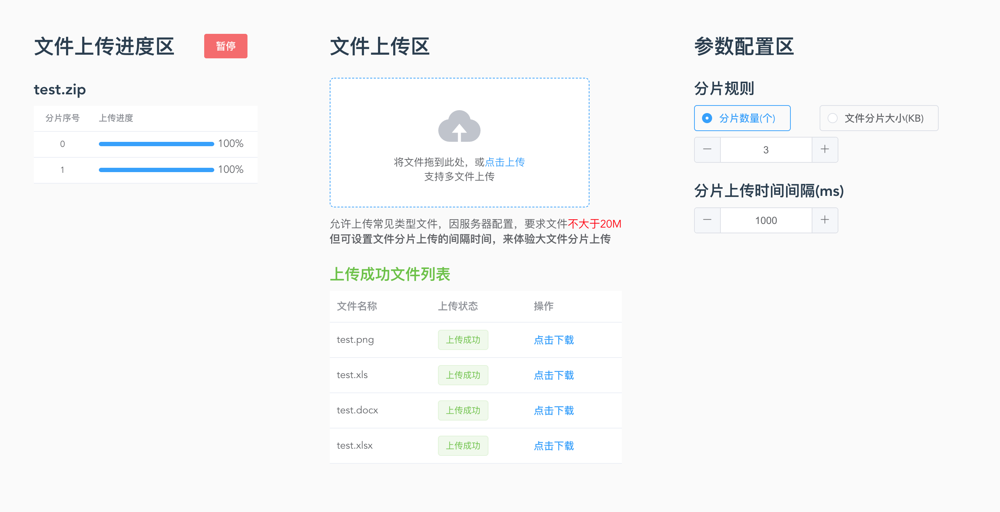
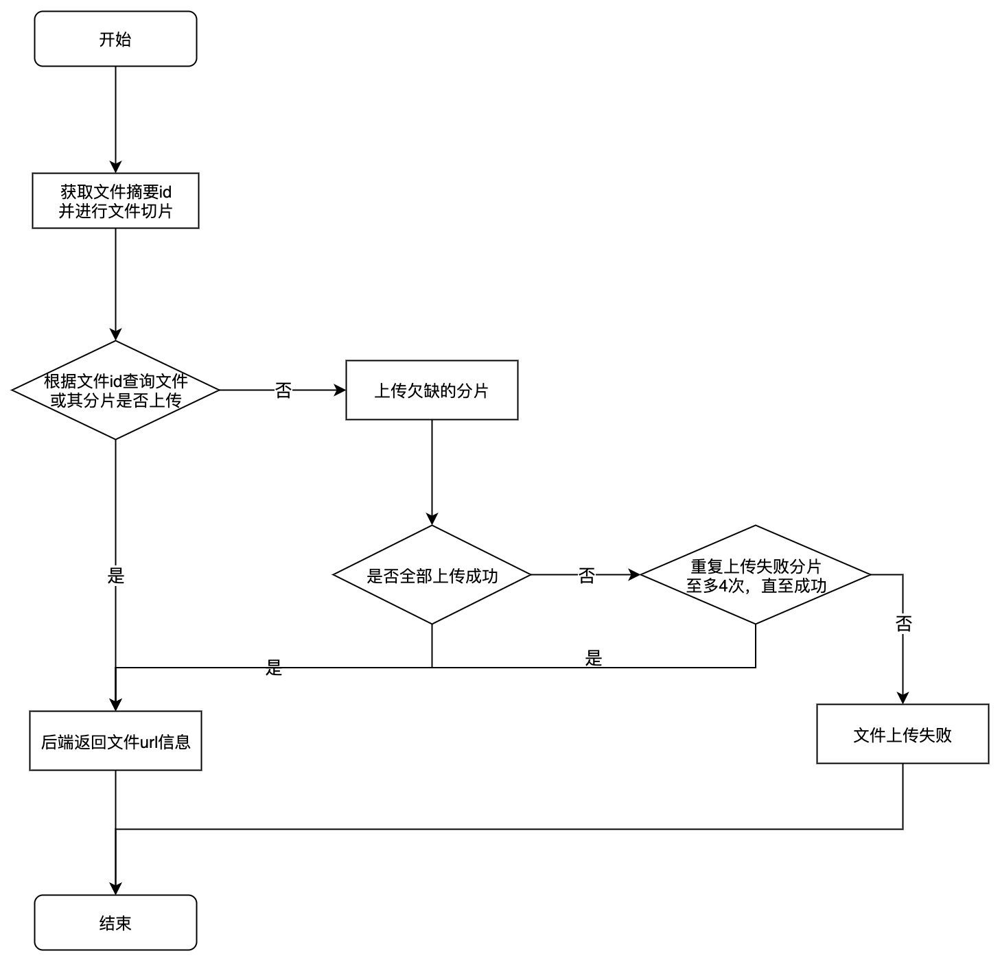

## 大文件上传

## 项目地址
**[在线访问地址](http://39.105.108.226:7003/index.html)**  
**[Github地址](https://github.com/kongkong99/Large-file-uplaod)**

**界面截图:**  
  

## 大文件分片整体流程
1. 计算文件摘要id
2. 文件切片并上传
   - 断点续传
   - 上传进度与暂停
3. 分片上传完成-后端进行分片合并
### 流程图




# 前端内容
## 计算文件摘要id
使用spark-md5 计算文件id
```javascript
const spark = new SparkMD5.ArrayBuffer();
const fileReader = new FileReader();
fileReader.onload = async (e) => {
    spark.append(e.target.result);
    const md5FileHash = spark.end(); // 文件的唯一标识
}
```


## 文件切片并上传
1. 计算分片数量和分片大小
```javascript
// 1: 分片数量为定值  2: 分片大小为定值
if (this.chunkType === '1') {
  chunks = this.chunkValue;
  chunkSize = Math.ceil(file.size / chunks);
} else if (this.chunkType === '2') {
  chunkSize = this.chunkValue * 1024;
  chunks = Math.ceil(file.size / chunkSize);
}
```

2. 文件切片并上传
```javascript
for (let index = 0; index < chunks; index += 1) {
    const end = (index + 1) * chunkSize >= file.size ? file.size : (index + 1) * chunkSize;
    
    const formData = new FormData();
    formData.set('index', index);
    formData.set('id', md5FileHash);
    formData.set('file', file.slice(index * chunkSize, end)); // 文件分片
    adapter.upload(formData); // 上传文件分片
}
```

3. 文件分片全部上传成功，调用接口通知后端合并
```javascript
const successFlag = 0; // 每上传成功一个分片，successFlag++

// 分片全部上传，则调用合并接口
if(successFlag === chunks) {
    adapter.uploadSuccess({filename, id}); // filename: 合并文件名称, id: 待合并文件的id
}
```

## 断点续传
1. 文件分片在上传过程中，可能会因为网络等原因上传失败，则需要再次上传
2. 上传文件可能存在已上传的分片，则只需要上传缺失的分片
```javascript
const formData = new FormData();
formData.set('index', index);
formData.set('id', md5FileHash);
formData.set('file', file.slice(index * chunkSize, end)); // 文件切片
const maxUploadNum = 4; // 单个分片最大上传次数
function uploadChunkFunc() {
    adapter.upload(formData).then(() => {
    }).catch(() => {
        // 上传失败，再次上传
        maxUploadNum -= 1
        if(maxUploadNum > 0) {
            uploadChunkFunc()；
        }
    })
}
```


## 上传进度与暂停
1. 获取进度, 利用axios的onUploadProgress方法
```javascript
 // 对原生进度事件的处理
onUploadProgress: (progressEvent) => {
  const { loaded, total } = progressEvent;
  const currentProgress = ((loaded / total) * 100).toFixed(0); // 当前进度
}
```

2. 暂停上传，利用axios的cancelToken取消上传网络请求
```javascript
const { CancelToken } = axios;
const cancelUpload = CancelToken.source();
axios({
  url: '',
  cancelToken: cancelUpload
})
cancelUpload.cancel(); // 取消网络请求
```

# 后端内容
## 语言与框架
采用node.js框架Egg.js 进行后端代码编写
## 接口内容  [详细接口文档连接](./接口文档.md)
1. 查询文件或文件切片上传情况
```javascript
import fs from 'fs-extra';
fs.pathExistsSync(path);
```
2. 文件切片上传
```javascript
import fs from 'fs-extra';
const writable = fs.createWriteStream(filePath);
fileContent.pipe(writable);
```
3. 文件切片合并
按照一定规则合并 所有文件切片
```javascript
// 合并文件
const mergeFiles = () => {
    if (index === chunkOrder.length) {
      writeStream.end();
      fs.removeSync(readPath);
      return;
    }
    const readStream = fs.createReadStream(path.join(readPath, chunkOrder[index]));
    readStream.pipe(writeStream, { end: false });
    readStream.on('end', () => {
      index += 1;
      mergeFiles();
    });
};
```
